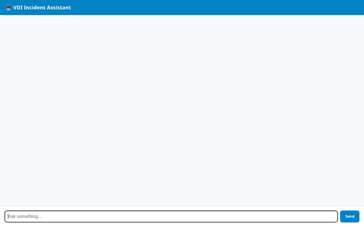

# VDI Incident Assistant (`vdi-incident-agent`)



**VDI Incident Assistant** is an agentic AI solution built with Google Cloud's Agent Development Kit (ADK) and deployed to Vertex AI Agent Engine. It helps Virtual Desktop Infrastructure (VDI) Engineers and Incident Responders diagnose failures, perform Root Cause Analysis (RCA), lookup vendor error codes, visualize architecture diagrams, generate diagnostic videos, and manage incident records across Citrix, Azure Virtual Desktop (AVD), Windows 365, and Horizon environments.

---

## 🌟 Capabilities & Features

### 1. 🖥️ VDI Troubleshooting & Root Cause Analysis (RCA)
- **Multi-Platform Diagnostics**: Troubleshoots Citrix Virtual Apps & Desktops (CVAD), Azure Virtual Desktop (AVD), Windows 365, Omnissa Horizon, and FSLogix profile storage issues.
- **Vendor Error Lookup**: Resolves error codes (e.g., `0x80070035` BAD_NETPATH, `0x0002` CTX_VDA_NOT_LICENSED, `0x80070005` ACCESS_DENIED) to specific causes, required firewall ports, and remediation steps.
- **Network Geolocation Lookup**: Queries IP addresses and domain names to retrieve real-time ISP, ASN, organization, and geolocation details for network path diagnostics.

### 2. 🗄️ Google Cloud Services & Integrations
- **Vertex AI Agent Engine / Agent Runtime**: Deployed serverless agent reasoning engine built on `google-adk` in region `us-east1`.
- **A2UI (Agent-to-User Interface)**: Dynamic UI rendering engine powered by `A2uiSchemaManager` (version 0.8) and `BasicCatalog`. Model outputs are transformed into rich, interactive component surfaces (Cards, Columns, Text, Images).
- **Google Cloud Firestore**: Real-time database storage for tracking incident tickets (`list_vdi_incidents`, `get_vdi_incident`, `save_vdi_incident`).
- **Vertex AI RAG Engine**: Serverless RAG corpus grounding agent answers against indexed domain documentation (`consult_herbal_corpus`).
- **Agent Memory Bank**: Automated session memory retention (`generate_memories_callback`) and pre-session memory preloading (`PreloadMemoryTool`).
- **Sandbox Code Execution**: Safe, isolated Python code execution in Agent Engine sandboxes (`AgentEngineSandboxCodeExecutor`).

### 3. 🎨 Multimodal Visual & Video Generation
- **Architecture Diagram Generation**: Uses `gemini-3.1-flash-lite-image` (in the `global` region) to create visual network topology and diagnostic diagrams. Saves images to the Playground Artifacts panel (`tool_context.save_artifact`) and uploads bytes directly to Google Cloud Storage (`vdi-incident-agent-assets-qwiklabs`).
- **Diagnostic Video Generation**: Uses `gemini-omni-flash-preview` (Interactions API in `global` region) to generate short video animations of server indicator lights and diagnostic flows. Saves video bytes to Playground Artifacts panel and uploads to Google Cloud Storage.

---

## 🏗️ Project Architecture

```
vdi-incident-agent/
├── app/
│   ├── agent.py               # Root agent definition, system instructions, A2UI configuration & tool bindings
│   ├── a2ui_utils.py          # A2UI model callback wrapper for A2A data parts
│   ├── firestore_tools.py     # Firestore CRUD tools for incident management
│   ├── vdi_tools.py           # Diagnostic lookup, network lookup, RAG retrieval, image & video generation tools
│   └── fast_api_app.py        # FastAPI server entrypoint
├── frontend/
│   ├── main.py                # FastAPI proxy server forwarding A2A requests to Agent Engine
│   ├── static/                # Rebranded chat web UI with client-side A2UI renderer
│   └── requirements.txt       # Frontend proxy container dependencies
├── agents-cli-manifest.yaml   # Agent manifest configuration (ADK, us-east1)
├── pyproject.toml             # Python dependencies and project specification
└── README.md                  # Project documentation
```

---

## 🛠️ Prerequisites & Setup

### Requirements
- **Python**: `3.10+`
- **uv**: Python package and environment manager
- **google-agents-cli**: Agent development CLI (`uv tool install google-agents-cli`)
- **Google Cloud SDK**: (`gcloud` CLI authenticated with project access)

---

## 🚀 Running Locally

1. **Install Dependencies**:
   ```bash
   uv sync
   ```

2. **Launch Development Playground**:
   ```bash
   agents-cli playground
   ```
   *The local playground auto-reloads on file changes and allows interactive testing of tools, memory, and A2UI responses.*

3. **Run Local Frontend Chat Proxy**:
   ```bash
   cd frontend
   pip install -r requirements.txt
   export AGENT_ENGINE_RESOURCE_NAME="projects/<PROJECT_ID>/locations/us-east1/reasoningEngines/<RESOURCE_ID>"
   export AGENT_DIRECTORY="app"
   python main.py
   ```

---

## ☁️ Deployment

### Deploys to Agent Engine (Vertex AI)

To deploy or update the agent on Agent Platform:

```bash
gcloud config set project <PROJECT_ID>
agents-cli deploy --project <PROJECT_ID> --region us-east1
```

### Deploys Frontend Proxy to Cloud Run

To build and deploy the frontend proxy to Cloud Run:

```bash
cd frontend
gcloud run deploy vdi-incident-agent-frontend \
    --source . \
    --region us-east1 \
    --project <PROJECT_ID> \
    --allow-unauthenticated \
    --set-env-vars AGENT_ENGINE_RESOURCE_NAME="projects/<PROJECT_ID>/locations/us-east1/reasoningEngines/<RESOURCE_ID>",AGENT_DIRECTORY="app"
```

Grant `roles/aiplatform.user` to the Cloud Run service account to permit A2A invocation:

```bash
gcloud projects add-iam-policy-binding <PROJECT_ID> \
    --member="serviceAccount:<PROJECT_NUMBER>-compute@developer.gserviceaccount.com" \
    --role="roles/aiplatform.user"
```

---

## 🔒 Security & IAM Roles

| Service / Component | Service Account | Required IAM Roles |
|---|---|---|
| Deployed Agent Engine | `service-<PROJECT_NUMBER>@gcp-sa-aiplatform-re.iam.gserviceaccount.com` | `roles/datastore.user` (Firestore), `roles/storage.objectAdmin` (GCS Bucket) |
| Cloud Run Frontend Proxy | `<PROJECT_NUMBER>-compute@developer.gserviceaccount.com` | `roles/aiplatform.user` |

---

## 📜 License
Licensed under the Apache License, Version 2.0.
